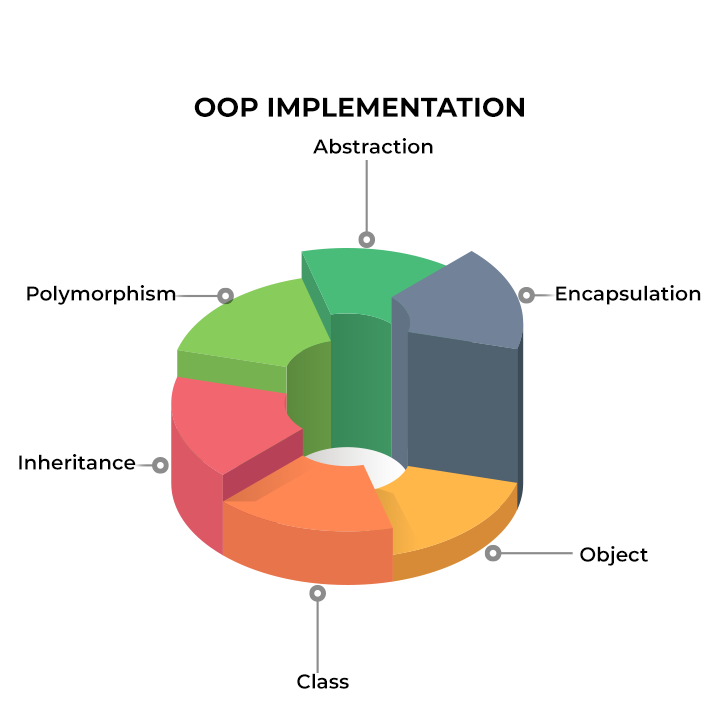

# An Introduction to Object Oriented Programming (OOP)

I learn to program with C++

## What is Object-Oriented Programming?

**Object-Oriented Programming (POO)** is a programming paradigm based on the concept of *objects*, which can contain data and code: data in the form of fields (often know as methods). In OOP, computer programs are designed by making them out of object that interact with one another.

